# Milestone 05 - Architecture, Boundaries, and State Machines

## Recovery gate

Architecture documents must match importable code and a running OpenAPI surface.
Define transaction ownership, repositories, provider interfaces, idempotency
keys, audit events, error semantics, and every state transition. Container tests
must cover allowed and forbidden transitions and prove external writes cannot be
triggered by approval or a retryable background task.

## Goal

Define the component boundaries and legal state transitions before database and connector code harden accidental assumptions.

## Architecture

```mermaid
flowchart LR
  A[Source adapters] --> B[Raw job ingestion]
  B --> C[Normalization]
  C --> D[Deduplication]
  D --> E[Deterministic rules]
  E --> F[LLM scoring]
  F --> G[Portfolio retrieval]
  G --> H[Proposal generation]
  H --> I[Factuality/quality gate]
  I --> J[Human review queue]
  J --> K[Manual submit or permitted connector]
  K --> L[CRM and follow-ups]
  L --> M[Metrics and tuning]
  P[Policy service] -.authorizes.-> A
  P -.authorizes.-> K
```



## Bounded modules

- **Policy** knows permissions, not platform implementation.
- **Sources** retrieve and preserve source payloads, not score jobs.
- **Normalization** converts source fields into canonical models.
- **Rules** performs deterministic rejection/priority.
- **Scoring** calls LLM providers and validates schemas.
- **Knowledge** stores evidence and retrieves relevant items.
- **Proposals** generates drafts and validates claims.
- **Review** owns user decisions and edits.
- **Submission** assists or invokes permitted actions.
- **CRM** owns lifecycle after approval/submission.
- **Workers** orchestrate tasks but contain no domain rules.

## Job state machine

```text
DISCOVERED -> NORMALIZED -> DUPLICATE | RULE_REJECTED | READY_TO_SCORE
READY_TO_SCORE -> SCORED | SCORE_FAILED
SCORED -> LOW_FIT | READY_TO_DRAFT
READY_TO_DRAFT -> DRAFTED | DRAFT_FAILED
DRAFTED -> IN_REVIEW
IN_REVIEW -> SKIPPED | NEEDS_EDIT | APPROVED
APPROVED -> READY_TO_SUBMIT
READY_TO_SUBMIT -> SUBMITTED_MANUAL | SUBMITTED_API | SUBMISSION_CANCELLED
SUBMITTED_* -> REPLIED | INTERVIEW | WON | LOST | WITHDRAWN
```

Transitions are commands with audit events. Never update status ad hoc.

## Proposal state machine

```text
GENERATING -> GENERATED -> VALIDATING -> VALID | INVALID
VALID -> IN_REVIEW -> EDITED | APPROVED | REJECTED
APPROVED -> LOCKED_FOR_SUBMISSION
```

Once locked, edits create a new proposal revision.

## Key interfaces

```python
class SourceAdapter(Protocol):
    platform_id: str
    async def discover(self, cursor: Cursor | None) -> DiscoveryBatch: ...
    async def fetch_detail(self, external_id: str) -> RawJob: ...

class LLMProvider(Protocol):
    async def score_job(self, request: ScoreRequest) -> ScoreResult: ...
    async def draft_proposal(self, request: ProposalRequest) -> ProposalResult: ...

class EvidenceRetriever(Protocol):
    async def retrieve(self, job: Job, limit: int) -> list[EvidenceChunk]: ...

class SubmissionConnector(Protocol):
    async def prepare(self, application_id: UUID) -> SubmissionPreview: ...
    async def submit(self, confirmation: ConfirmationToken) -> SubmissionReceipt: ...
```

## Cross-cutting rules

- UTC times.
- Correlation ID per ingestion/application flow.
- Idempotency key per external side effect.
- Policy check before network or write action.
- Structured audit event after every transition.
- PII minimized at module boundaries.

## Required deliverables

- `docs/ARCHITECTURE.md`
- `docs/STATE_MACHINES.md`
- `docs/adr/0003-modular-monolith.md`
- `docs/adr/0004-server-rendered-dashboard.md`
- protocol/interface modules with no concrete implementations
- state enums and transition tests


## Acceptance criteria

- **M05-AC01:** `docs/ARCHITECTURE.md` defines every bounded module's
  responsibility, forbidden responsibility, dependency direction, and the rule
  that workers orchestrate application services without containing domain rules.
- **M05-AC02:** Importable repository and unit-of-work protocols define
  transaction ownership, optimistic state checks, idempotency lookup, atomic
  state-and-audit persistence, UTC timestamps, and UUID aggregate identifiers
  without adding a concrete repository or Milestone 06 schema.
- **M05-AC03:** Importable source, LLM, embedding, evidence, notification, and
  submission protocols use provider-neutral request/result types and contain no
  selected marketplace, provider model, endpoint, credential, or threshold.
- **M05-AC04:** The job state machine contains every documented job state and
  exhaustive container tests cover its complete allowed-edge matrix, forbidden
  edges, cross-machine attempts, and terminal states.
- **M05-AC05:** The proposal state machine contains generation, validation,
  review, edit, rejection, approval, and locked-for-submission semantics;
  exhaustive container tests prove a locked revision cannot be edited in place.
- **M05-AC06:** The application state machine keeps package preparation,
  submission cancellation, manual/API submission, and outcomes distinct;
  exhaustive container tests cover allowed, forbidden, cross-machine, and
  terminal transitions.
- **M05-AC07:** A transition command is the only application-service mutation
  contract and requires aggregate identity, expected state, actor, reason,
  correlation ID, and idempotency key. Successful commands atomically emit a
  structured secret-free audit event; conflicts and invalid transitions expose
  stable typed error semantics.
- **M05-AC08:** Architecture and importable contracts require a current
  fail-closed policy decision before external I/O and require an owner feature
  flag plus a destination/checksum-bound, short-lived, single-use confirmation
  token for any future API write.
- **M05-AC09:** Container tests prove proposal approval performs no connector
  call, approval only permits package preparation, and retryable worker
  transition handling cannot invoke an external submission operation.
- **M05-AC10:** A running FastAPI container exposes typed architecture,
  state-machine, and transition-validation operations in OpenAPI; real HTTP
  tests prove those operations execute the importable contracts and return
  stable success and error schemas. Milestone Docker gates, the repository fast
  suite, clean-checkout reproduction, placeholder scan, evidence analysis, and
  independent policy/release review all pass.
